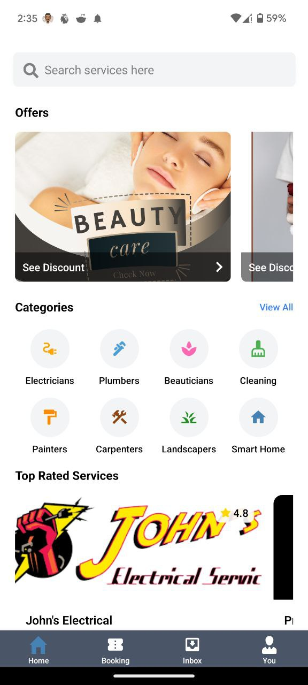
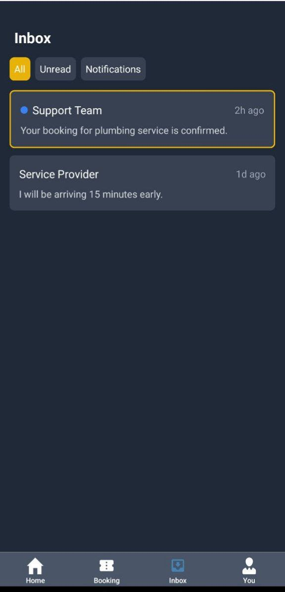
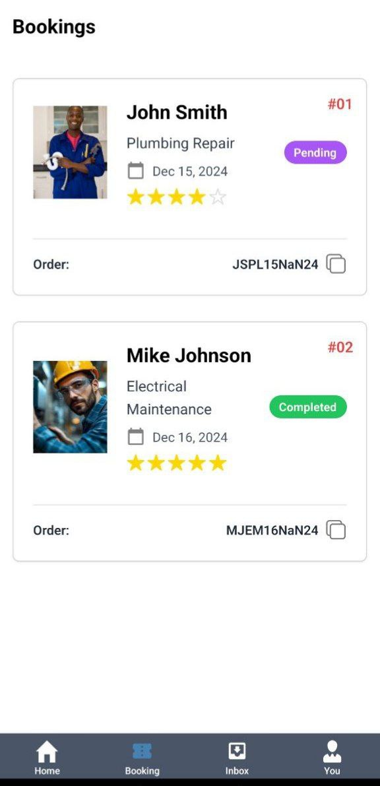
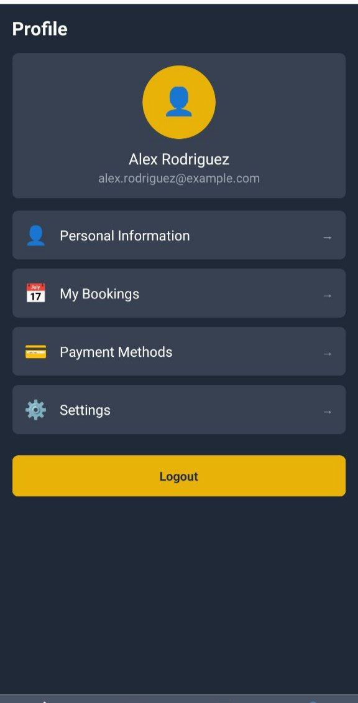

# Handyman Mobile App

Welcome to the **Handyman Mobile App**, your one-stop solution for finding reliable and skilled handymen for all your household or business needs. This app connects users with professionals offering services such as plumbing, electrical work, carpentry, cleaning, and more.

---

## Features

- **User-Friendly Interface**: Effortless navigation to find and book services.
- **Service Categories**: Wide range of handyman services like plumbing, electrical repairs, painting, cleaning, etc.
- **Real-Time Notifications**: Get updates about bookings and service status.
- **Secure Payments**: Easy and safe payment methods integrated within the app.
- **Reviews and Ratings**: Check reviews to select the best professionals for your needs.

### User Profiles
- Personal profile management with photo uploads
- View and edit personal information
- Upload profile pictures using Cloudinary integration
- Role switching between client and service provider

### Service Provider Features
- Professional profile creation with service descriptions
- Certification uploads and verification
- Service pricing and availability settings
- Customer request management

### Client Features
- Browse service providers by category
- View provider details, ratings, and reviews
- Book services with convenient scheduling
- Track booking status and history

---

## Technology Stack

The app is built using modern and robust technologies:
- **Frontend**: [Expo Router](https://expo.dev/router) with React Native for cross-platform compatibility.
- **Programming Language**: TypeScript for type safety and better code quality.
- **Backend**: Integration with APIs for seamless data handling.
- **State Management**: React hooks and context for smooth user experience.

---

## How to Install and Run the App

1. **Clone the Repository**:
   ```bash
   git clone https://github.com/G-Bryan237/Handyman.git
   cd Handyman
   `

2. Install dependencies

   ```bash
   npm install

3. Start the app

   ```bash
    npx expo start or npm start
   ```

In the output, you'll find options to open the app in a

- [development build](https://docs.expo.dev/develop/development-builds/introduction/)
- [Android emulator](https://docs.expo.dev/workflow/android-studio-emulator/)
- [iOS simulator](https://docs.expo.dev/workflow/ios-simulator/)
- [Expo Go](https://expo.dev/go), a limited sandbox for trying out app development with Expo

You can start developing by editing the files inside the **app** directory. This project uses [file-based routing](https://docs.expo.dev/router/introduction).

## Screenshots
[HOME_PAGE]
<div>  </div>

[INBOX_PAGE]
<div>  </div>

[BOOKING_PAGE]
<div>  </div>

[PROFILE_PAGE]
<div>  </div>

## Technical Implementation

### Profile Management
- User authentication with JWT tokens
- Secure profile data storage and retrieval
- Image processing and cloud storage via Cloudinary
- Real-time profile updates

### Backend Integration
- RESTful API communication
- Robust error handling for network issues
- Offline capabilities and data persistence

## Contact

Feel free to reach out with feedback or inquiries:

- **Email**: [e.bryandze@gmail.com]
- **X** : [https://x.com/dze_bryan]
- **LinkedIn**: [www.linkedin.com/in/dzebryan237]
- **GitHub**: [https://github.com/G-Bryan237]

---
